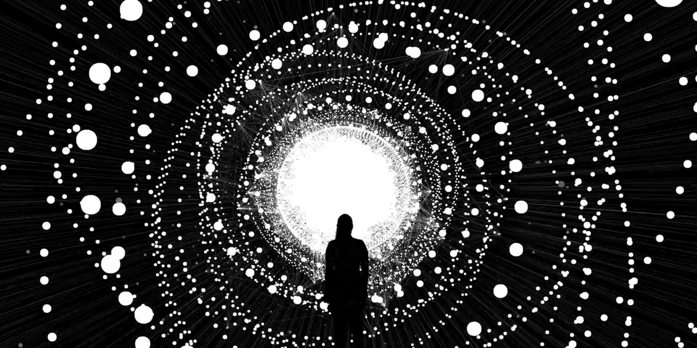
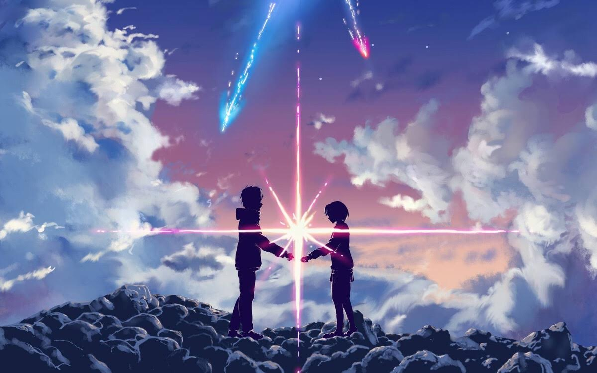
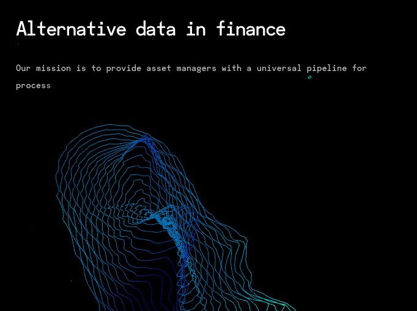
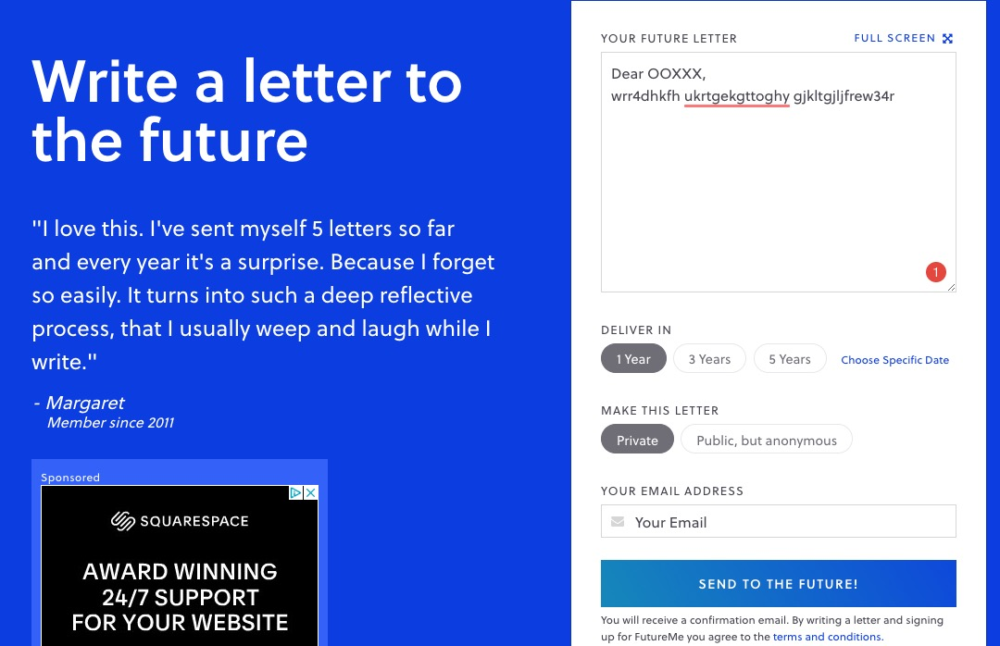
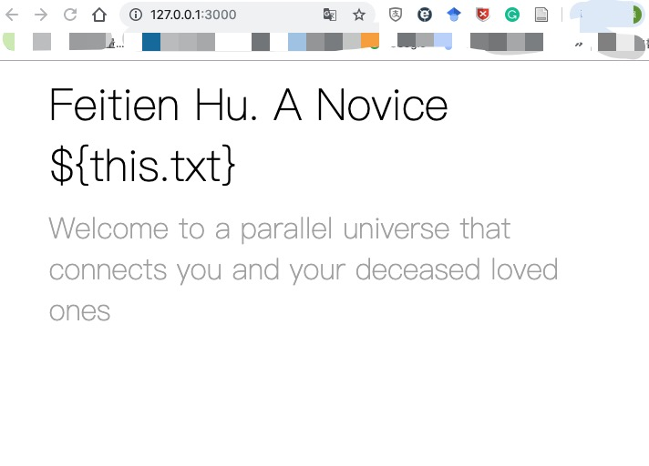

# Fei-tien Hu's Final Project Proposal
This is a proposal for my 5003 final project.

## Summary  
* I am designing a website for people to communicate with whom they miss a lot but no longer have a chance to talk to them physically. I often imagine that there might be a certain kind of secret space, such as a parallel universe that can connect the people on earth and the deceased one in the afterlife world. Users can write an email on the site, embed photos, and create their customized letter to their deceased ones. They can choose to download this letter to their local or email to themselves on the day they hope to receive. I hope to create a space that helps people deliver their messages to their deceased ones and make them feel therapeutic.

* This website is in memory of my beloved grandparents.

## Inspiration

As a novice designer & a teacher who enjoys embracing challenges ahead yet gets nervous easily, I have always been interested in things that can calm people’s minds and heal their hearts. Inspired by religious rituals in Taiwan and a computer-animated film Coco, I want to explore the world of the afterlife, and the way to communicate with our loved ones who had passed away. My beloved grandparents who raised me in my childhood left me 5 years ago and 1 year ago respectively. I often think of them and cannot help but burst into tears while I am alone. Multiple research has shown that writing can heal and can serve as a therapy. Whenever I think of them, I write, and I found that writing down what I want to say to them helps me deal with sadness.

I would like my audience to interact with my website by writing letters to someone they miss a lot but might no longer have a chance to meet them physically. I would like them to feel therapeutic.

* Technically, I think these are the steps needed to test my concept: I need to figure out how to make interactive tables and beautiful buttons, how to make it automatically form a poster based on the words and photos provided by users, and how to create an auto tying effect on the landing page.

* I have researched into a few similar projects, such as [futureme](https://www.futureme.org/) and [the typing effect on the landing page of this website](http://dataf.org/en/). I think in the next few weeks, I would like to use the class time to find out how to create a beautiful letter writing table on the webpage and integrate JS interactive elements to make it automatically form a customized poster. Visually, I would like my piece to look like a beautiful imagery afterlife world with a mailbox that can link me and deceased ones in the two parallel universe.  

* Some Visual References:

## Reference
[FutureMe] (https://www.futureme.org/)
[Data Fork] (http://dataf.org/en/)

## Process
I teach myself by googling and watching Youtube tutorials. However, there are still some issues with my codes that hinder me from implementing the auto typing effect. I think I need to spend more time finding out the bugs on my project and figuring out what exactly was going on. About how to let users automatically create a customized letter (i.e. automatically create a poster with their words and photo on it.), I still have no idea how to make it since I am not very sure about the keywords I should use on Google search engome. I think I will need to consult Zhenzhen or other experienced classmates to figure out if this is something within my capacity.
* (P.S. There should be some auto typing effect on the screenshot below, but d
due to some bugs in my code, I haven’t figured out how to adjust them yet. I will keep working on this until I fix it. Details can be seen in the code.)

